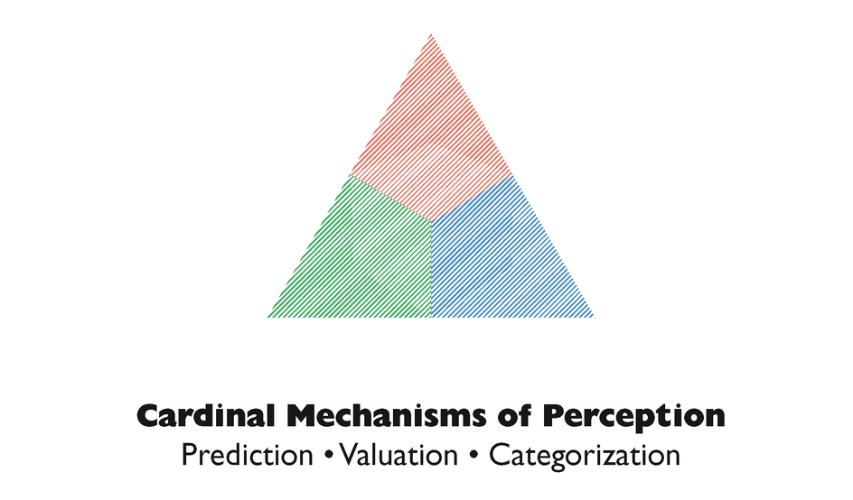

# Research Data Management (RDM)

## Overview 

This RDM workshop is designed to give a generic overview of RDM principles and practices. In most research fields there are field specific and community driven standards and practices, especially for file organization and metadata. This workshop does not address this field specific standards as it was designed for a broad audience from different research areas. 

## Topics 💡

Under the following sections you'll find the `objectives` for each of the topics we'll discuss during this workshop and further `materials/readings`.

- Introduction to RDM 
- The Open Science Framework (OSF) 
- Research Data Management Plan (RDMP) 
- Pre-registration 
- Project and Data Organization 
- Metadata 
- Version Control 
- Data Storage and Sharing 
- Copyright and Licenses

## optional/reading/further materials

- [The Turing Way Handbook](https://the-turing-way.netlify.app/reproducible-research/rdm)
- [UK Data Service](https://ukdataservice.ac.uk/learning-hub/research-data-management/)
- [HeFDI workshops, materials, and publications](https://www.uni-marburg.de/en/hefdi/about-hefdi)
- [forschungsdaten.info](https://forschungsdaten.info/themen/informieren-und-planen/)
- [OHBM Open Science Educationals](UChvSitFvqGDeA1y7MJs4CGQ)
- [NOWA Blog](https://sfbs.pages.uni-marburg.de/sfb135/nowa/nowa.site/post/) and [tutorials](https://sfbs.pages.uni-marburg.de/sfb135/nowa/nowa.site/tutorial/)
- [NOWA School: a one week school on RDM and reproducible code using Python](https://julia-pfarr.gitlab.io/nowaschool)
- [Brainhack School Modules](https://school.brainhackmtl.org/modules/)

## Acknowledgements

My work on this workshop was enabled through my work and training as a Data Steward in the [SFB 135](https://www.sfb-perception.de/) "Cardinal Mechanisms of Perception", infrastructure project [NOWA](https://sfbs.pages.uni-marburg.de/sfb135/nowa/nowa.site/).

<figure markdown="span">
  { width="300" }
</figure>
