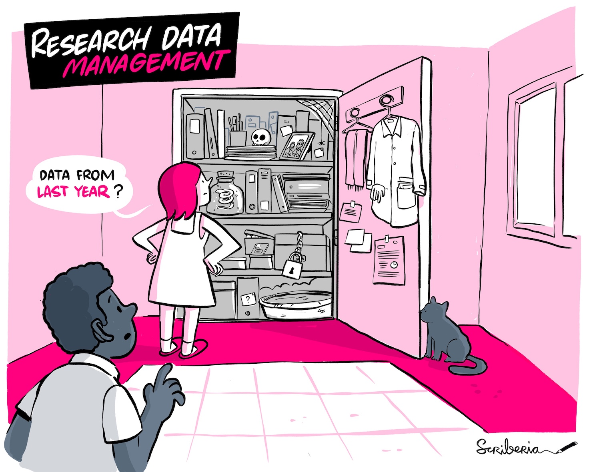
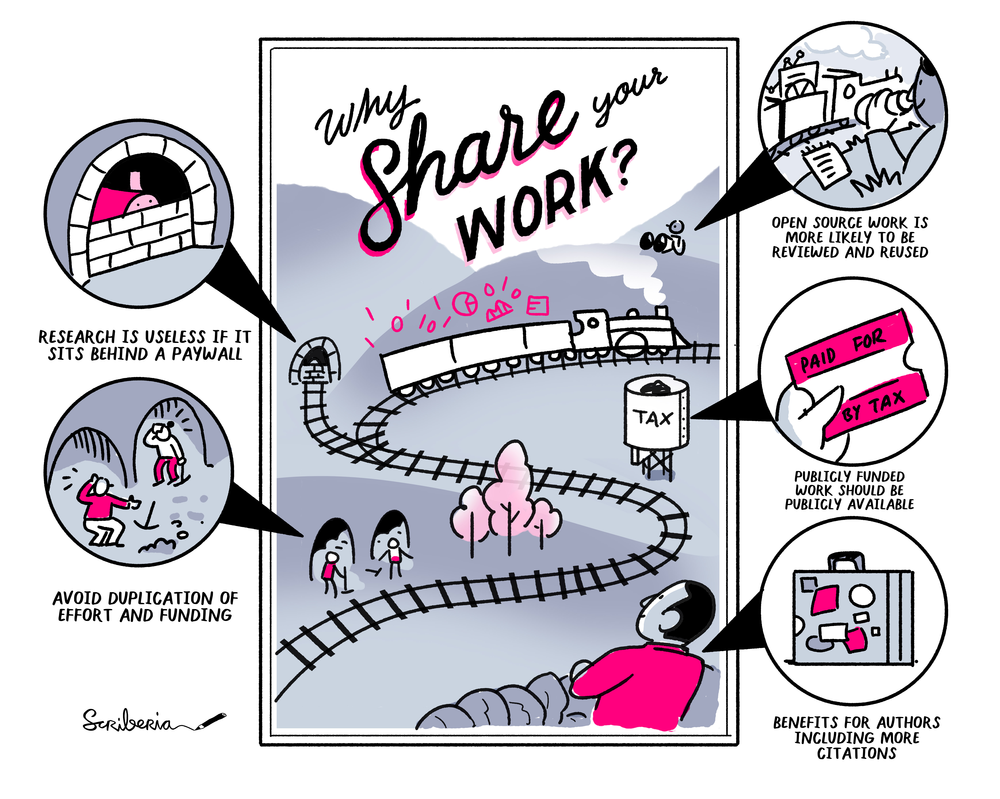

!!! abstract "Objectives📍"

    - What Research Data Management (RDM) means and why it is important
    - The FAIR principles
    - The Research Life Cycle
    - RDM & Open Science
    - Overview of RDM components

### Summary

<figure markdown="span">
  { width="600" }
  <figcaption>Research Data Management: making it possible to retreive data from last year. The Turing Way project illustration by Scriberia. Reused under a CC-BY 4.0 license. Original version on Zenodo. http://doi.org/10.5281/zenodo.3695300.</figcaption>
</figure>

Research Data Management (RDM) entails practices of storing, annotating, and re-using research data. We are all doing it every day: we all store, sort, and annotate our data in our own way, namely in the way we've always been doing it and how we feel the most comfortable with. This might be sufficient, you think - at least that's how it feels in the moment. However, leaving RDM to be an individual issue results in several restrictions for the individual as well as for science per se. When getting back to your data after some time (1) and try to find, read, and understand it, you might realize that your way of storing, sorting, and annotating your data isn't so intuitive after all. 
{ .annotate }

1. e.g., you've done your work and submitted a manuscript, got reviews which want you to give some more information on your data/analyses or run some more analyses.

Do you find everything you need in a short time? Do you understand the different folders and files instantly? Does your code still run without errors? Do you know which was the latest version of your project? Maybe...or maybe not? So, if you yourself, the master of your data, are unable to confidently reuse your data...what about others? 

The field of RDM provides us with recommendations, schemes, and standards which eventually will save all of us a lot of time and memory while also fostering collaboration, preventing data loss, and improving the overall quality of science. 

### The Research Data Lifecycle 

RDM techniques are aiming to support our research work in all stages of the so-called **Research Data Lifecycle**:

<figure markdown="span">
  { width="600" }
  <figcaption>Research Data Lifecycle. The Turing Way project illustration by Scriberia. Reused under a CC-BY 4.0 license. Original version on Zenodo. http://doi.org/10.5281/zenodo.3695300.</figcaption>
</figure>

Depending on your career stage, you might not have been confronted with every single stage of this cycle yet. However, each step of the research life cycle needs to be considered for RDM. Developing a research idea is exciting and fun but your idea will only come true when you care just as much about the other stages in the research data lifecycle. Here's what you will encounter during the different stages:

=== "Planning & Design"

    * design research
    * plan data management
    * plan consent for sharing
    * plan data collecting, processing, protocols, and templates
    * explore existing data sources

=== "Collecting data"

    * collect data
    * capture data with metadata
    * acquire existing third party data 

=== "Processing & analysing data"

    * enter, digitize, transcribe, and translate data
    * check, validate, clean, anonymize
    * derive data
    * describe and document data
    * manage and store data
    * analyse and interpret data
    * produce research outputs
    * cite data sources

=== "Publishing & sharing data"

    * establish copyright
    * create user documentation
    * create discovery metadata
    * select appropriate access to data
    * publish/ share data
    * promote data

=== "Preserving data"

    - migrate data to best format/media
    - store and back up data
    - create preservation documentation
    - preserve and curate data 

=== "Reusing data"

    * conduct secondary analysis
    * undertake follow-up research
    * conduct research reviews
    * scrutinize findings
    * use data for teaching and learning

### The FAIR principles and practices

Behind every RDM technique stands the FAIR principles. FAIR means that research and data should be

- **F**indable: Annotating your research and data with proper Metadata goes a long way. This enables to search for specific keywords and find the respective research items.
- **A**ccessible: Data users must know how to access the data. This starts with simple metadata about hard- and software requirements and involves information about potential authentication and authorisation procedures. 
- **I**nteroperable: Reuse of data and collaboration can only work if the data is provided in a way that it can be easily integrated with other data or easily operated with other applications. 
- **R**eusable: Again, sufficient metadata and requirements for using your data in different settings have to be given to make your data reusable. 

Here's what you should know about FAIR:

- By making your data FAIR you expand the life-cycle of your data and contribute to sustainability in the digital world, which brings benefits for your own research as well as the whole science community.
- FAIR does not equal open. Following the FAIR principles does not necessarily mean that you have to share your data with everyone. Your data can meet the FAIR principles but still be shared under certain restrictions.
- The intention of the FAIR principles is not to have everybody apply all the principles to all their data perfectly right away. Implementing just a few of the recommended steps helps you and the science community to get one step further toward open science. The important thing is simply to start somewhere to get used to practicing the FAIR principles on your data regularly. Step by step.
- The FAIR principles are guidelines, not a standard.

### RDM & Open Science 

<figure markdown="span">
  { width="600" }
  <figcaption>Private Data. The Turing Way project illustration by Scriberia. Reused under a CC-BY 4.0 license. Original version on Zenodo. http://doi.org/10.5281/zenodo.3695300.</figcaption>
</figure>

Personally, I think that there are two misunderstandings when people think of Open Science. 

First, just putting everything you have in your project folder on some repository and sharing it with the world does not make your research "open". If your data isn't FAIR, people won't be able to derive any more information from it than you've given in a conventional paper. People might not be able to open your files, don't know what your data is about without sufficient metadata, cannot run your code due to proprietary software you used etc. etc. 

Second, making your research open does not mean that you have to share everything you have with everyone in the world. Sometimes this is simply not possible, for example when it comes to personal data. This is a good thing, people deserve their right to having their private data protected. What you can still do then though, is to share comprehensive metadata to let people know what your data is about and grant them authorized access (i.e., Data User Agreements). If you then additionally share your code, other researchers can still reuse your resources for reproducibility and/or replicability purposes. 

Thus, RDM and Open Science go hand in hand: without proper RDM your research won't be open. 

Applying RDM standards to your work and contributing to Open Science benefits you by increasing your data quality, accountability, reputation in the science community, time efficacy, visibility & transparency and many more:

<figure markdown="span">
  { width="600" }
  <figcaption>Reasons for sharing your work. The Turing Way project illustration by Scriberia. Reused under a CC-BY 4.0 license. Original version on Zenodo. http://doi.org/10.5281/zenodo.3695300.</figcaption>
</figure>

### RDM components

As described above, RDM aims to support you in all stages of the research data lifecycle. However, there are some components of RDM which are especially important and which we will get to know in more detail in this workshop:

- Planning & Design: Making a Research Data Management Plan (rdmp) and pre-registering your study
- Data collection: Organizing your data and annotating it with metadata
- Analysing data: using open source software and version control as well as ensuring reproducibility of your research
- Publishing & sharing data: Popular repositories, data privacy, copyright, and licenses
