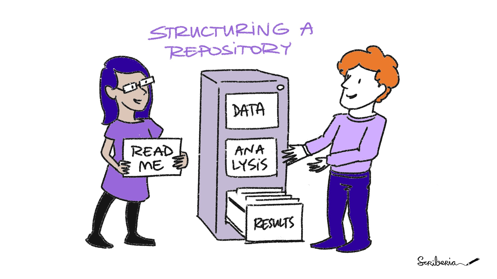

!!! abstract "Objectives📍"

    - folder structure
    - file naming
    - variable naming
    - backups


## Project Organization

To organize your data, you should use a clear folder structure to ensure that you can find your files. For this there are already multiple existing templates.

<figure markdown="span">
  { width="600" }
  <figcaption>The Turing Way_ project illustration by Scriberia. Used under a CC-BY 4.0 licence. DOI: [10.5281/zenodo.3332807](https://doi.org/10.5281/zenodo.3332807)</figcaption>
</figure>

If you don't find any template that suits your needs (which I doubt...), make sure you follow these general suggestions on organization of folders: 

-	Make sure you have enough (sub)folders so that files can be stored in the right folder and are not scattered in folders where they do not belong, or stored in large quantities in a single folder.
-	Use a clear folder structure. You can structure folders based on the person that has generated the data/folder, chronologically (month, year, sessions), per project (as done in the example below), or based on analysis method/equipment or data type.
- Avoid overlapping or vague folder names, and do not use personal data in folder/file names.
- All good structures contain at least the following elements:
    - A unique main folder for the project
    - Some form of code
    - Some form of data
    - A readme document with any important information about the project for yourself or collaborators

### Project Organization: One Example [^1]

```
.
├── LICENSE.md
├── README.md
├── code
│   ├── experiment
│   ├── analysis
├── data              
│   ├── processed      <- The final, canonical data sets for modeling. 
│   ├── raw            <- The original, immutable data dump. 
│   └── temp           <- Intermediate data that has been transformed. 
├── docs               <- Documentation notebook for users.
│   ├── manuscript     <- Manuscript source, e.g., LaTeX, Markdown, etc.
│   ├── study-protocol <- or `preregistration`
│   └── reports        <- Other project reports and notebooks (e.g. Jupyter, .Rmd)
└── results
    ├── figures        <- Figures for the manuscript or reports 
    └── output         <- Other output for the manuscript or reports 
```

It doesn't matter too much if you name the folder with processed data `processed` and have it under the upper folder `data` or if you have it one level up and name it instead `edited data` or what have you. The important thing is that you choose a structure and stick to it and best explain it to others by putting an explanation of the project folder structure in a README. What you should do though is checking out if there are community standards for folder structure in your research field. For example, in psychology and neuroscience we have a widely accepted and comprehensively documented standard called [BIDS](https://bids-standard.github.io/bids-starter-kit/folders_and_files/folders.html). Some data repositories now expect you to have the data in this format, otherwise they won't accept your data. So, just make sure that you follow recommendations and principles in your field of research (if there are any). 

!!! note "Task"

    Go through your project folder and re-organize it using the above mentioned recommendations. 

## File Naming Conventions

Structure your file names and set up a template for this.
For example, it may be advantageous to start naming your files with the date each file was generated.
This will sort your files chronologically and create a unique identifier for each file.
The utility of this process is apparent when you generate multiple files on the same day that may need to be versioned to avoid overwriting.

Some other tips for file naming include:

- Use the date or date range of the experiment: `YYYY-MM-DD`
- Use the file type
- Use the researcher's name/initials
- Use the version number of file (v001, v002) or language used in the document (ENG)
- Do not make file names too long (this can complicate file transfers)
- Avoid special characters (?\!@\*%{[<>) and spaces
- Avoid personal data in file names

You can explain the file naming convention in a README file so that it will also become apparent to others what the file names mean.

[Jenny Bryan’s ‘naming things’ presentation](https://speakerdeck.com/jennybc/how-to-name-files) (also available as a [5 minute summary video on youtube](https://youtu.be/ES1LTlnpLMk)) gives very concrete and intuitive recommendations and examples. Here's the main content of her talk for you: 


|Don't do this| Do this instead|
|---|---|
| myabstract.docx | 2022-09-24_abstract-for-normconf.docx |
| Jane’s Filenames Use “Spaces” & Punctuation ;).xlsx | janes-filenames-are-getting-better.xlsx |
| figure 1.png | fig01_scatterplot-talk-length-vs-interest.png | 
|  JW7d^(2sl@deletethisandyourcareerisoverWx2*.txt | 1986-01-28_raw-data-from-challenger-o-rings.txt |

Good file names are:

- machine readable
- human readable
- sorted in a useful way

*Machine readable*

[Wikipedia](https://en.wikipedia.org/wiki/Glob_(programming)): **globbing** = "glob patterns specify sets of filenames with wildcard characters. For example, the Unix Bash shell command mv *.txt textfiles/ moves all files with names ending in .txt from the current directory to the directory textfiles. Here, * is a wildcard and *.txt is a glob pattern. The wildcard * stands for "any string of any length including empty, but excluding the path separator characters (/ in unix and \ in windows)". "

This means: use  `_` underscore to delimit fields, i.e. when you have multiple `.csv` files that contain data of one type of observations and need to be parsed to one `dataframe` in the end, use the observation name in the file name and delimit this name from the rest of the filename using an underscore. This way you can easily find it with the `ls` command and easly code the read-in for data analysis. At the same time, use  `-` hyphen to delimit words *within* fields.

Example: If you have a list of files named like this `2022-09-24_Plasmid-Cellline-100-1MutantFraction_A01.csv`, `2022-06-26_Plasmid-Cellline-100-1MutantFraction_H02.csv`, `2022-06-26_Plasmid-Cellline-100-1MutantFraction_H03.csv` you can do multiple machine operations with it:

- you can find those files in your folder under all the other files by simply typing `ls *Plasmid*` in the terminal
- you can read in the different parts of the filename as headers for your dataframe by coding a delimiter rule, e.g., in `R` a code like: 

```
separate_wider_delim(
    filenames,
    delim = regex("[_\\.]"),
    names = c("date", "assay", "well", NA)
)
```

leads to an output of:

||date|assay|well|
|---|---|---|---|
|1|2022-09-24|Plasmid-Cellline-100-1MutantFraction|A01|
|2|2022-06-26|Plasmid-Cellline-100-1MutantFraction|H02|
|3|2022-06-26|Plasmid-Cellline-100-1MutantFraction|H03|

*Human readable*

Make sure that at least you yourself are able to decode from the filename what is in it. Try also to make it easy for others to guess what something is. 

|Don't do this| Do this instead|
|---|---|
|01.md|01_marshal-data.md|
|01.R|01_marshal-data.R|
|02.md|02_pre-dea-filtering.md|
|02.R|02_pre-dea-filtering.R|
|03.md|03_dea-with-limma-voom.md|
|03.R|03_dea-with-limma-voom.R|
|04.md|04_explore-dea-results.md|
|04.R|04_explore-dea-results.R|
|9.md|90_limma-model-term-name-fiasco.md|
|90.R|90_limma-model-term-name-fiasco.R|

*Dates*

To be able to sort file in a chronological order it is always a good idea to include a date in the filename. For this you should respect `ISO 8601` which states that dates should be written in the `YYYY-MM-DD` format. Don't let the US convince you to use MM-DD-YYYY...they're really the only ones using this format.

*Sorted in a useful way*

- plan for alphanumeric sorting
- put something numeric-ish first-ish
- use the ISO 8601 standard for dates
- left pad numbers with zeros. Otherwise the file starting with a `10` will be shown above the file starting with a `1` in the folder, which is confusing. 

## Variable naming

Basically, all of the above about file naming conventions applies equally to variable naming. Here are some conventions you should know about:

- CamelCase
- lowerCamelCase
- Underscore_Methods
- Mixed_Case_with_Underscores
- lowercase

!!! note "Task"

    Go through your project files and rename files and variables using the above mentioned recommendations.

!!! note "Task"

    Go to your OSF project and upload your newly organized folder. You can either upload the whole folder in your OSF project main page or use the *components* feature in OSF. 


Again, checking out if there are community standards in your research field for file and variable naming is a good idea. The above mentioned [BIDS](https://bids-standard.github.io/bids-starter-kit/folders_and_files/folders.html) standard, for example, gives instructions on that, too. 


## optional/reading/further materials

#### Project Organisation: Other Examples

- [This](http://nikola.me/folder_structure.html) folder structure by Nikola Vukovic
- You can pull/download folder structures using GitHub:
[This template](https://github.com/bvreede/good-enough-project) by Barbara Vreede, based on [cookiecutter](https://github.com/cookiecutter/cookiecutter), follows recommended practices for scientific computing by [Wilson et al. (2017)](https://doi.org/10.1371/journal.pcbi.1005510).
- See [this template](https://osf.io/4sdn3/) by Chris Hartgerink for file organisation on the [Open Science Framework](https://osf.io/).
- [How to Organize Your Digital Files](https://www.nytimes.com/wirecutter/guides/how-to-organize-your-digital-files/) by Melanie Pinola.
- [Project structure videos by Danielle Navarro](https://www.youtube.com/watch?v=u6MiDFvAs9w&list=PLRPB0ZzEYegPiBteC2dRn95TX9YefYFyy&index=1) (with [slides](https://slides.djnavarro.net/project-structure/#1)).

#### More Information on Project Organisation

- [How to organise your data and code](https://renebekkers.wordpress.com/2021/04/02/how-to-organize-your-data-and-code) by Rene Bekkers. 


#### More Information on File naming

- [MIT's recommendations on File naming and folder hierarchy](https://libraries.mit.edu/data-management/store/organize/)
- [8 step guide on how to set up your file naming convention](https://resolver.caltech.edu/CaltechAUTHORS:20200601-161923247) 

#### File renaming tools

If you want to change your file names you have the option to use bulk renaming tools.
Be careful with these tools, because changes made with bulk renaming tools may be too rigorous if not carefully checked!

Some bulk file renaming tools include: 
- [Bulk Rename Utility](http://www.bulkrenameutility.co.uk/Main_Intro.php), [WildRename](http://www.cylog.org/utilities/wildrename.jsp), and [Ant Renamer](http://www.antp.be/software/renamer) (for Windows)
- [Renamer](https://renamer.com/) (for MacOS)
- [PSRenamer](http://www.cylog.org/utilities/wildrename.jsp) (for MacOS, Windows, Unix, Linux)


!!! info
    Most of the content was copied from [The Turing Way Handbook](https://the-turing-way.netlify.app/reproducible-research/rdm/rdm-storage) under a CC-BY 4.0 licence.


[^1]: adapted from [this template](https://github.com/bvreede/good-enough-project) by Barbara Vreede.