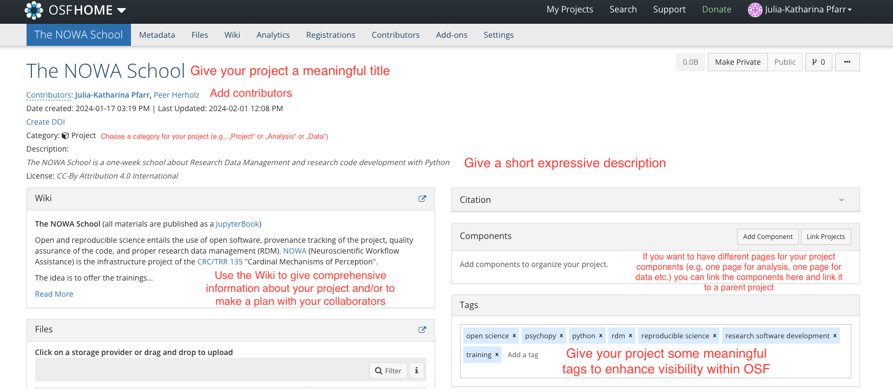

!!! abstract "Objectives📍"

    - What OSF is and why it is useful
    - First settings for an OSF project

Here are the main points about the OSF, retrieved from their [paper](10.5195/jmla.2017.88)[^1], p.203-204:

- "The Open Science Framework (OSF) is a tool that promotes open, centralized workflows by enabling capture of different aspects and products of the research lifecycle, including developing a research idea, designing a study, storing and analyzing collected data, and writing and publishing reports or papers." 
- "The core functionality of the OSF is its ability to create and develop projects."
- "Each user, project, component, and file is given a unique, persistent uniform resource locator (URL) to enable sharing and promote attribution."
- "Projects can also be assigned digital object identifiers (DOIs) and archival resource keys (ARKs) if they are made publicly available." 
- "The OSF provides built-in version control that records changes to project files and previous versions through OSF Storage." 
- "The OSF is intended to be collaborative, and users can easily add contributors to projects."
- "While there are many features built into the OSF, the platform also allows third-party add-ons or integrations that strengthen the functionality and collaborative nature of the OSF." 
- "Registration is a major feature of the OSF and its efforts to preserve, provide access to, and promote transparency in research." 

For a very nice overview of how OSF supports you in your work during the whole Research Life Cycle, I recommend to watch this introduction video by OSF:

<iframe width="560" height="315" src="https://www.youtube.com/embed/X07mBq2tnMg?si=7cGQUY6QxNWyMJXa" title="YouTube video player" frameborder="0" allow="accelerometer; autoplay; clipboard-write; encrypted-media; gyroscope; picture-in-picture; web-share" allowfullscreen></iframe>

### OSF Project - First Settings

As you've read above and/or seen in the video, OSF supports you in the management of your project through its whole life cycle. During this school, we want to learn how to use the OSF services. The best way of learning how to use OSF is by doing. 

!!! note "Task" 

    Go to [OSF](https://osf.io/) and create a new project for your own project and complete the first settings. 

Here's a short explanation what settings you can choose from in the beginning:

Extra note on "components": If your project contains data that you don't want to share openly, you should organize your project through the components feature on OSF as you can choose the visibility feature for every component differently. 

Over the course of this workshop we will fill this OSF project with all the input and output from your own project. 

[^1]: Foster, E. D., & Deardorff, A. (2017). Open Science Framework (OSF). Journal of the Medical Library Association : JMLA, 105(2), 203–206. https://doi.org/10.5195/jmla.2017.88