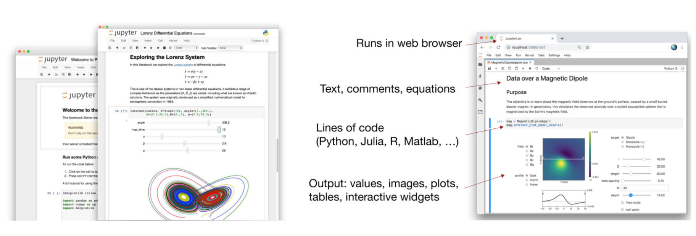
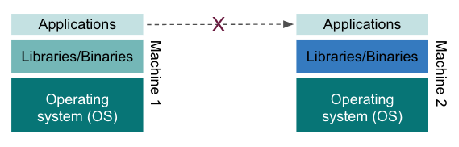
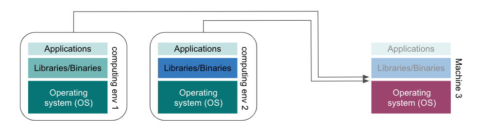
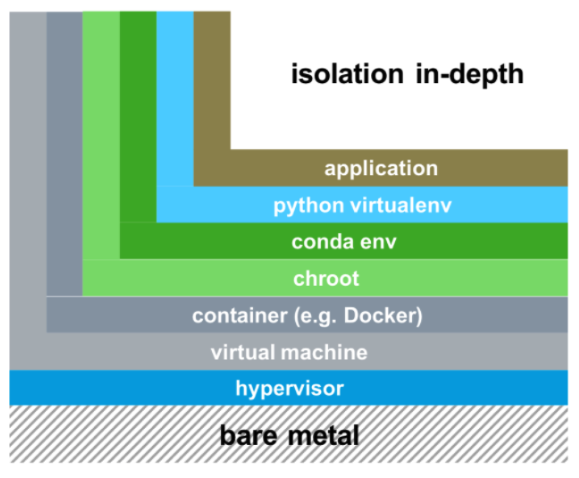
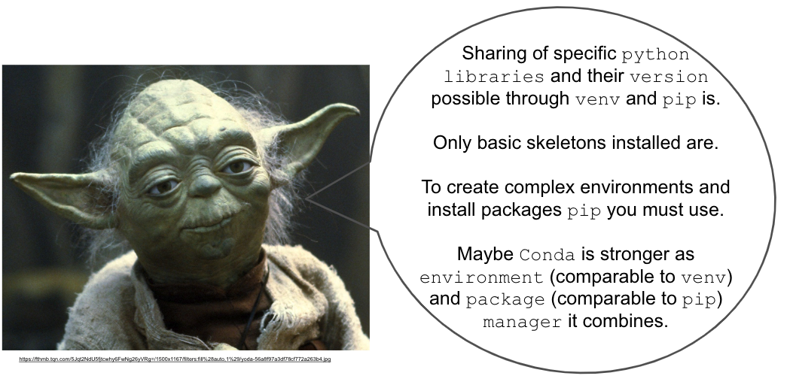
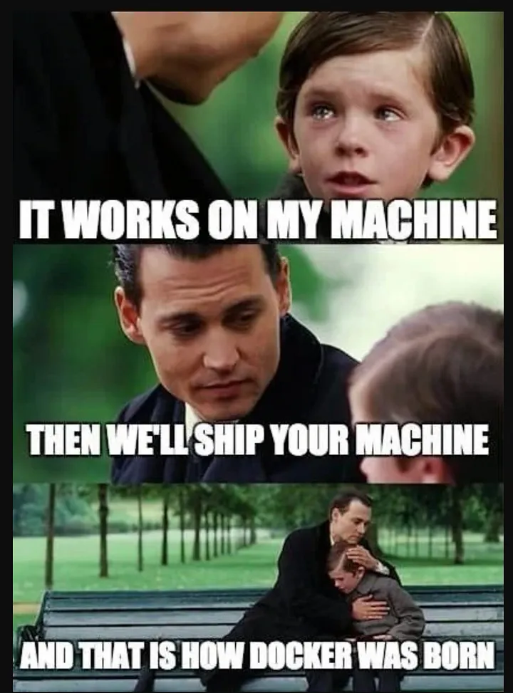

!!! abstract "Objectives📍"

    - the jupyter ecosystem
    - levels of computational environments

## Jupyter notebooks

A [Jupyter notebook](https://jupyter-notebook.readthedocs.io/en/latest/) is a shareable document that combines computer code, plain language descriptions, data, rich visualizations like 3D models, charts, graphs and figures, and interactive controls. A notebook, along with an editor (like [JupyterLab](https://github.com/jupyterlab/jupyterlab)), provides a fast interactive environment for prototyping and explaining code, exploring and visualizing data, and sharing ideas with others.

Writing your analyses in a `jupyter notebook` not only brings benefits for your own work but can ensure the reproducibility of your results. You can share your `jupyter notebook` together with your conventional paper and thus other researchers or the reviewer of your paper can directly track and reproduce your analysis. This gives high credibility of your work. Besides that, it's just so awesome with it's many features, the big community and support! 

<figure markdown="span">
  { width="1000" }
  <figcaption>Example of a jupyter notebook.</figcaption>
</figure>

Some universities offer a so-called [JupyterHub](https://jupyter.org/hub) which is basically an environment to maintain a `JupyterLab`. JupyterLab enables you to work with documents and activities such as Jupyter notebooks, text editors, terminals, and custom components in a flexible, integrated, and extensible manner. For a demonstration of JupyterLab and its features, you can view this video:

<iframe width="560" height="315" src="https://www.youtube.com/embed/A5YyoCKxEOU?si=kPzCKPD2OF9Xb5CW" title="YouTube video player" frameborder="0" allow="accelerometer; autoplay; clipboard-write; encrypted-media; gyroscope; picture-in-picture; web-share" allowfullscreen></iframe>

## Computational Environments

!!! info
    Most of the content was copied from Peer Herholz's ["There and back again: a short introduction to virtualization technologies"](https://docs.google.com/presentation/d/1Hy6FCn3OxROGc_-7FDib9OBdcl_NED9LIoahzcExspc/edit?usp=sharing) and from [Docker vs. python virtualization vs. virtual machines](https://stephen-odaibo.medium.com/docker-containers-python-virtual-environments-virtual-machines-d00aa9b8475#:~:text=Docker%20containers%20package%20all%20the,Tensorflow%201.13%20and%20Keras%202.1.) by Dr. Stephen Odaibo

**The problem statement**

Imagine you want to conduct an analysis of some demographic data, including obtaining & reading data, filtering & descriptive analyses of data, inferential statistics and visualization. A colleague has a python script that does all of these things ready to go and shares it with you. Everything is ok….

The script doesn’t run? The script leads to different results?  

<figure markdown="span">
  { width="600" }
  <figcaption>...but it worked on my machine?!</figcaption>
</figure>

**What went wrong?**

- each and every single project in a lab depends on complex software environments:
    - operating system
    - Drivers
    - Software dependencies: Python, R, MATLAB + libraries

<figure markdown="span">
  { width="600" }
</figure>

This leads to statements like: 

- "The computer I used was shut down a year ago, I can’t rerun the analyzes from my publication…"
- "The analyzes were run by my student, I have no idea where and how..."
  

**Virtualization technologies** aim to isolate the computing environment by providing a mechanism to encapsulate environments in a self-contained unit that can run anywhere. Thus, with virtualization techniques it is possible to reconstruct and share computing environments.

<figure markdown="span">
  { width="600" }
</figure>

Virtualization technologies have 3 main types:

{ align=right width="400" }

|python virtualization|containers|virtual machines|
|---|---|---|
|venv|Docker|Virtualbox|
|conda|Singularity|VMware|

*Python virtualization*

Python virtual environments are a mechanism to prevent incompatibility clashes and other forms of conflict that arise from 3rd party python libraries share space to an extent. For instance, an update of tensorflow from 1.13 to 2.0 may result in breakage of any applications that relied particularly on tensorflow 1.13. 

To avoid this problem one would like to configure environments that have specific signatures as pertains to 3rd party python packages. For instance, one virtual environment could be out TF2.0/Keras 2.2.5/Python 2.7.14 environment, while another is our TF2.0/Keras 2.0/Python 3.6.8 environment, and yet another our TF1.10-gpu/Keras 2.3.0/Python3.6.0 environment. This setup facilitates sandboxing and encourages experimentation by greatly decreasing the risk that we will break anything. 

Python virtual environments...

- keep the dependencies required by different projects in separate places
- allows you to work with specific version of libraries or Python itself without affecting other Python projects
- Applications
    - [venv](https://docs.python.org/3/library/venv.html): an environment manager for Python 3.4 and up, usually preinstalled
    - [conda](https://conda.io/en/latest/): an environment manager and package manager (for python and beyond)

<figure markdown="span">
  { width="600" }
</figure>

*Containers*

A container wraps an application’s software into an invisible box with everything the application needs to run. That includes the operating system, application code, runtime, system tools, system libraries, and etc. All the operating system level architecture is being shared across containers. One of those container systems is *Docker*. Docker containers have fully prescribed dependencies with which they can be created. These dependencies as well as the instruction on how specifically to create the container are stored in the container’s image. The image of a container is portable and can be registered on one of a number of registries/repositories/hubs. Once there, anyone can “pull it” so long as they know its unique name.

<figure markdown="span">
  { width="400" }
</figure>

Unlike a VM which provides hardware virtualization, a container provides operating-system-level virtualization by abstracting the “user space”. 

## optional/reading/further materials

- [Understanding Conda and Pip](https://www.anaconda.com/blog/understanding-conda-and-pip)
- [A beginner friendly intro to VMs and Docker](https://www.freecodecamp.org/news/a-beginner-friendly-introduction-to-containers-vms-and-docker-79a9e3e119b/#.3giab6wvo)
- [Intro to Docker from Neurohackweek](https://neurohackweek.github.io/docker-for-scientists/)
- [Understanding Images](https://code.tutsplus.com/tutorials/docker-from-the-ground-up-understanding-images--cms-28165)
- [Singularity examples](http://singularity.lbl.gov/tutorials)
- [one day docker workshop](https://github.com/PeerHerholz/docker_workshop)
- [Docker vs. python virtualization vs. virtual machines](https://stephen-odaibo.medium.com/docker-containers-python-virtual-environments-virtual-machines-d00aa9b8475#:~:text=Docker%20containers%20package%20all%20the,Tensorflow%201.13%20and%20Keras%202.1.)